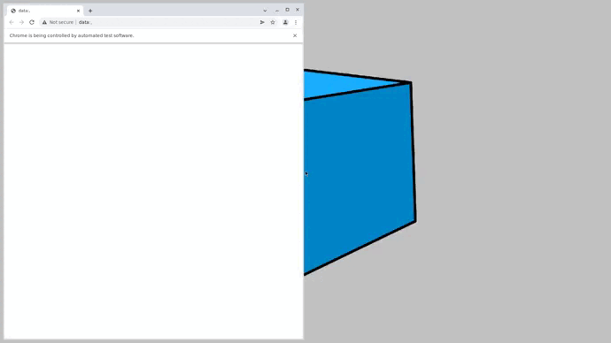
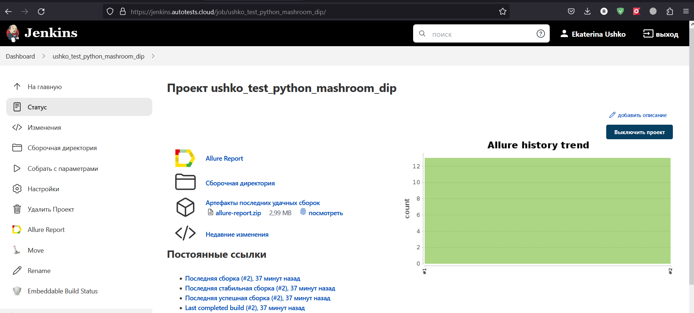
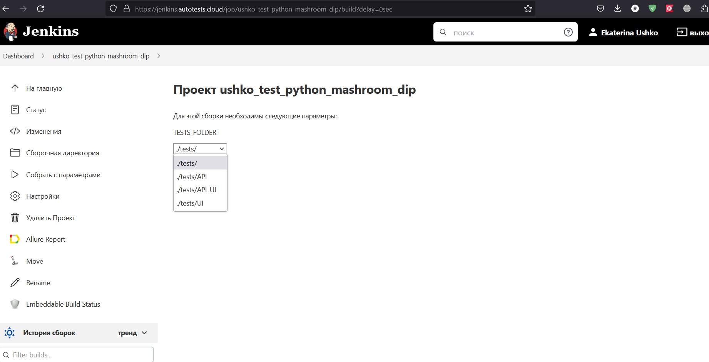
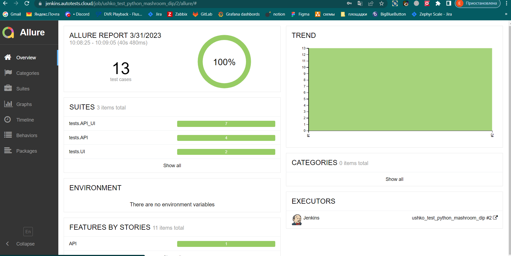
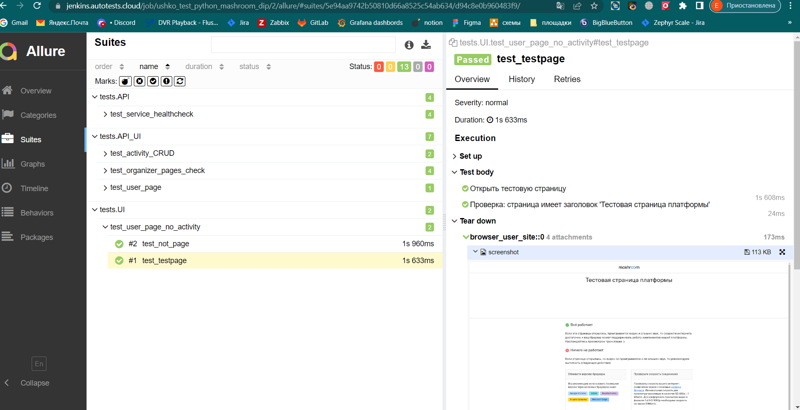
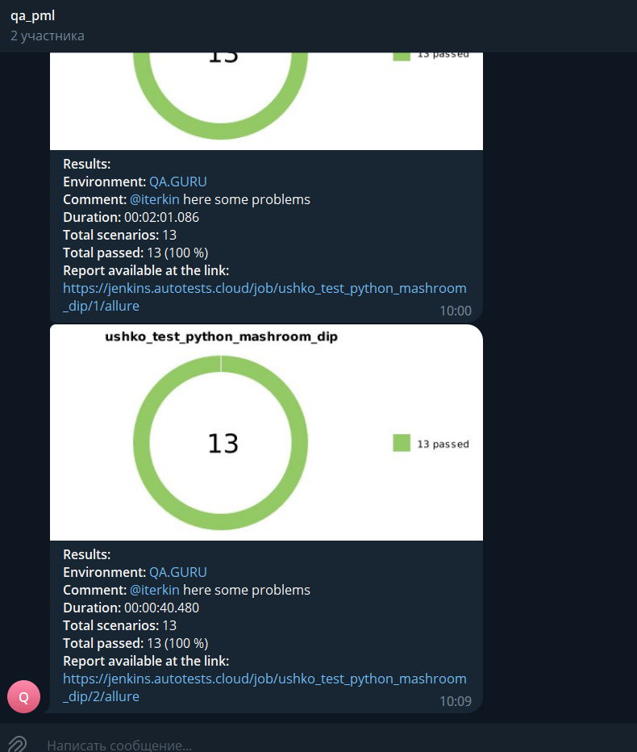

# Автотесты для проекта pikemedia.live

* API- Проверки доступности сервисов проекта
  * ✅ poll
  * ✅ eventor
  * ✅ chat
  * ✅ viewer
* API_UI Проверки страниц, требующих авторизации пользователя
  * ✅ CRUD мероприятия
  * ✅ Просмотр страниц административного интерфейса
* UI Проверки страниц, доступных для неавторизованного пользователя:
  * ✅ Просмотр тестовой страницы
  * ✅ Просмотр страницы "мероприятие не найдено"


## Технологический стек
Python, Pytest, Selene, PyCharm, Requests, Jenkins, Selenoid, Github, Telegram

<p  align="left">
<div>
  &nbsp;
  &nbsp; 
  &nbsp;  
  &nbsp; 
  &nbsp;    
  &nbsp;
  &nbsp; 
</div>
<br>

## Как запустить
Перед выполнением необходимо:
* в .env определить параметры конфигурации:
```
STEND_URL_UI - url административного интерфейса
STEND_URL_API - url api административного интерфейса
STEND_URL_USER_UI - url проекта SITE интерфейса
STEND_URL_WIDGET_UI - url проекта WIDGET интерфейса
LOGIN - email пользователя-организатора
PASSWORD - пароль пользователя-организатора
SELENOID_LOGIN - логн от SELENOID
SELENOID_PASSWORD - пароль от SELENOID
```

### Локально
```
pytest .\tests\  
```

### Удаленно
```bash
python -m venv .venv
source .venv/bin/activate
pip install -r requirements.txt
pytest ${TESTS_FOLDER}
```

### Видео о прохождении тестов
В видео представлен тест test_profile_page_createactivity из группы тестов API_UI.
Тест выполняет последовательно действия:
1. Авторизация
2. Создание объекта "мероприятие"
3. Проверка значения имени, присвоенного объекту на странице созданного мероприятия


### Запуск в Jenkins
Ссылка на пример сборки: https://jenkins.autotests.cloud/job/ushko_test_python_mashroom_dip/
Статистика по запускам <br >


### Параметры запуска <br >
* .\tests\  - запустить все тесты в директории tests (в проекте).
* .\tests\UI  - запустить все тесты в директории tests/UI. Эти тесты используют только интерфейс UI.
* .\tests\API - запустить все тесты в директории tests/API. Эти тесты используют только интерфейс API.
* .\tests\API_UI  - запустить все тесты в директории tests/API_UI. Эти тесты используют задействую оба интерфейса: API и UI.


### Отчёт о прохождении автотестов в Allure Report
Ссылка на пример отчета: https://jenkins.autotests.cloud/job/ushko_test_python_mashroom_dip/2/allure


### Список автотестов в Allure Report


### Уведомления о прохождении автотестов в Telegram
